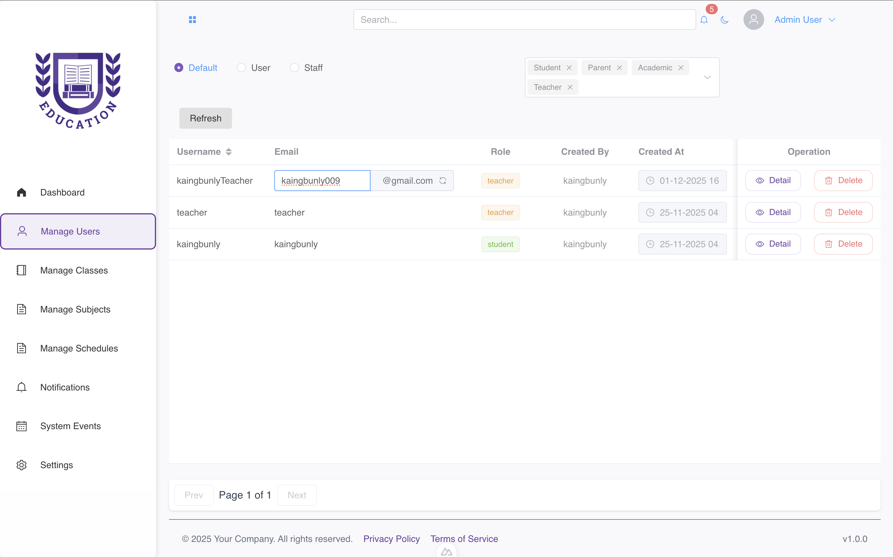

# Backend Architecture: School Management System

## Overview

This backend is built using **Flask** and strictly follows a **Domain-Driven Design (DDD)-like architecture**. Each domain or "bounded context" is isolated into its own folder containing all necessary components (models, services, routes, tests).

This architectural approach ensures:
* **Separation of Concerns:** Business logic is isolated from database access and HTTP handling.
* **Scalability & Modularity:** New features can be added in their own context without affecting existing domains.
* **Maintainability:** Clear file structure simplifies debugging and onboarding new developers.

---

## 📂 Folder Structure

The core of the architecture resides within the `app/contexts/` directory, reflecting the separation of domains:

```

app/
├─ contexts/
│  ├─ admin/                \# Admin-specific operations (User management, system config)
│  │  ├─ models.py          \# Domain models (database schemas)
│  │  ├─ services.py        \# Core business logic
│  │  ├─ routes.py          \# Flask routes / API endpoints
│  │  ├─ read\_models.py     \# Models optimized for read-only queries (reporting)
│  │  ├─ data\_transfer/     \# DTOs (Request/Response schemas)
│  │  ├─ error/             \# Context-specific exceptions (e.g., UserNotFoundError)
│  │  └─ tests/             \# Unit and integration tests for this context
│  ├─ academic/             \# Curriculum, grading, term management
│  ├─ schools/              \# School registration, class creation
│  └─ ... (other contexts: student, teacher, auth, iam, etc.)
├─ uploads/                 \# Dedicated file storage handling (isolated from services)
├─ **init**.py              \# Flask app factory / initialization
├─ run.py                   \# App entry point (e.g., python run.py)
├─ requirements.txt         \# Python dependencies
└─ Dockerfile / Procfile    \# Deployment configurations

````

---

##  Backend Request Flow

This flow illustrates the path a request takes from the API layer down to the database and back, enforcing the rule that **Routes only talk to Services, and Services only talk to Models/Repositories.**

### Flow Explanation

| Layer | File / Folder | Responsibility |
| :--- | :--- | :--- |
| **Routes** | `routes.py` | Receives HTTP requests, validates input data (via DTOs), and calls the appropriate Service method. **No business logic here.** |
| **Service** | `services.py` | Contains the **business logic**. Orchestrates complex operations, enforces rules, and handles multi-step transactions. |
| **Model / Repo** | `models.py` | Handles direct **database access** (CRUD operations) and data schema definitions. |
| **Read Models** | `read_models.py` | Used for querying and reporting where the domain models might be inefficient (CQRS-like approach). |
| **DTOs** | `data_transfer/` | Defines and validates the structure of data for both API **requests** and **responses**. |
| **Errors** | `error/` | Provides custom, domain-specific exceptions for granular error handling and messaging. |

### Diagram: Backend Flow

```mermaid
graph TD
    subgraph Frontend
        A[Vue Component] -->|Calls API| B[Flask Route routes.py]
    end

    subgraph Backend (Flask)
        B -->|1 Calls Service| C[Service Layer services.py]
        C -->|2 Business Logic & Validation| D[Model Repository models.py]
        D -->|3 CRUD Operations| E[Database]
        E -->|4 Data Response| D
        D --> C
        C -->|5 Final Result| B
    end

    subgraph Response
        B -->|HTTP Response| A
    end
````

-----

##  Adding a New Context / Module

To add a new, fully self-contained domain (e.g., **`library`**):

1.  **Create the Context Folder:**

    ```bash
    mkdir -p app/contexts/library/{data_transfer,error,tests}
    ```

2.  **Add Core Files:** Create the standard files inside the `library` context:

      * `models.py`, `services.py`, `routes.py`, `read_models.py`, `__init__.py`

3.  **Implement Logic:**

      * Define database schema in `models.py`.
      * Implement core use cases (e.g., `checkout_book`) in `services.py`.
      * Define API endpoints (e.g., `/api/library/books`) in `routes.py`.

4.  **Register Blueprint:** In the main application initialization file (`app/__init__.py`), register the new blueprint so Flask recognizes the routes.

-----

##  Testing Structure Recommendation

Tests are kept local to their context for isolation and faster execution.

```
app/contexts/<context>/tests/
├─ test_models.py       # Focuses on ORM/database interactions (integration)
├─ test_services.py     # Focuses on business logic and orchestration (unit)
├─ test_routes.py       # Focuses on API input/output and status codes (integration)
└─ __init__.py
```

-----

##  Benefits of This Architecture

| Principle | Benefit |
| :--- | :--- |
| **Separation of Concerns** | Ensures business logic is testable and independent of Flask routing details. |
| **Modularity** | Each context is self-contained and reusable, minimizing side effects when changes are made. |
| **Scalability** | Allows large teams to work in parallel on different domains with minimal conflict. |
| **Testability** | Context-local tests ensure a high coverage and simplify continuous integration. |
| **Maintainability** | Consistent file structure and context-specific error handling simplify debugging and code reviews. |

```

## Overview

This backend is built using **Flask** and strictly follows a **Domain-Driven Design (DDD)-like architecture**...


