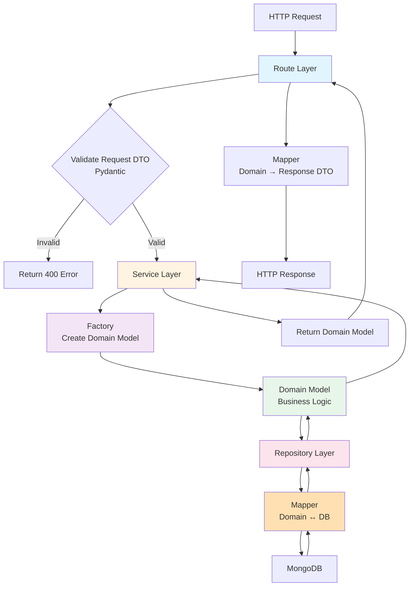
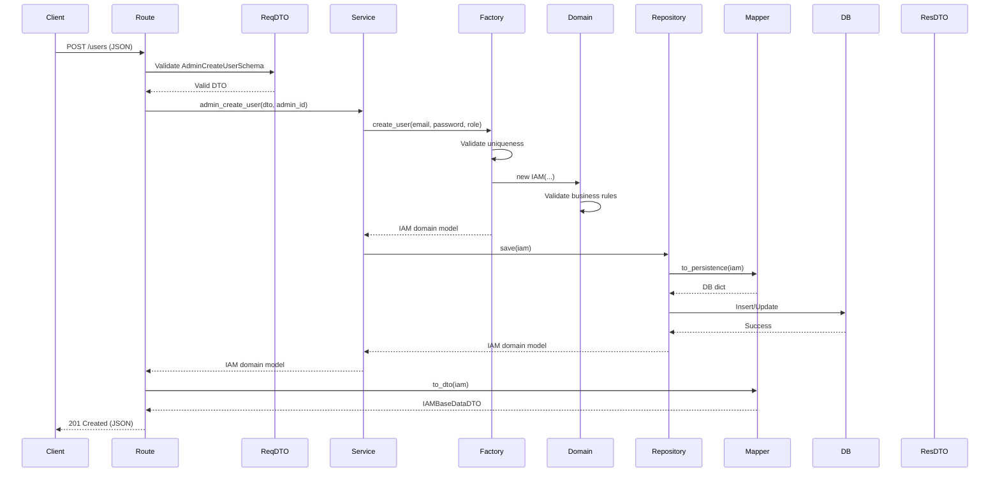

# 🏛️ Backend Architecture: School Management System

## 🌟 Overview

This backend is built with **Flask** and follows a **Domain-Driven Design (DDD)** Pure OOP architecture. Each domain ("bounded context") is isolated, with pure Python domain models, services orchestrating logic, repositories handling persistence, and routes handling HTTP with DTO validation.

### Core Request Flow:
1. **Route validates Request DTO** (Pydantic)
2. **Route calls Service Layer**
3. **Service converts DTO → Domain Model** (via Factory if complex)
4. **Service orchestrates business logic** using Domain Models
5. **Service calls Repository** for persistence
6. **Repository uses Mapper** for Domain ↔ DB conversion
7. **Route converts Domain Model → Response DTO**
8. **Return HTTP Response**

### Key Benefits:
- **Pure OOP** – Domain models are plain Python classes, no ORM inheritance
- **Separation of Concerns** – Services handle logic, repositories handle persistence, routes handle HTTP
- **Scalability & Modularity** – Each context is self-contained
- **Maintainability** – Clear OOP structure simplifies debugging
- **Testability** – Domain models can be tested without database

---

## 📂 Folder Structure

```
backend/
├─ app/
│  ├─ contexts/
│  │  ├─ admin/
│  │  │  ├─ domain/           # Pure OOP domain models
│  │  │  ├─ factory/          # Domain object creation
│  │  │  ├─ services/         # Business logic orchestration
│  │  │  ├─ routes/           # HTTP endpoints + DTO conversion
│  │  │  ├─ repository/       # Database operations
│  │  │  ├─ mapper/           # Domain ↔ Database mapping
│  │  │  ├─ read_models/      # Optimized queries
│  │  │  ├─ data_transfer/    # Request/Response DTOs
│  │  │  ├─ error/            # Domain-specific exceptions
│  │  │  └─ tests/
│  │  ├─ iam/
│  │  ├─ student/
│  │  ├─ teacher/
│  │  └─ ...
│  ├─ core/                      # Shared utilities
│  │  ├─ security/              # Auth, JWT, decorators
│  │  └─ error/                 # Base exceptions
│  └─ __init__.py                # Flask app factory
├─ run.py
├─ requirements.txt
└─ Dockerfile
```

---

## 🔄 Architecture Flow



### Layer Responsibilities

| Layer | Responsibility |
|-------|---------------|
| **Routes** | Validate Request DTO, call Service, convert Domain → Response DTO |
| **Service** | Convert DTO → Domain (via Factory), orchestrate business logic, call repositories |
| **Factory** | Create complex domain objects with validation |
| **Domain Models** | Pure Python classes with business rules (NO database code) |
| **Repository** | Handle database CRUD operations |
| **Mapper** | Convert Domain Model ↔ Database dictionaries |
| **Read Models** | Optimized read-only queries |
| **DTOs** | Request/response contracts with client |

---

## 🔍 Layer Details with Real Implementation

### 1️⃣ Routes Layer (routes.py)

**Responsibilities:**
- Validate Request DTO (Pydantic)
- Call Service Layer
- Convert Domain Model → Response DTO
- Handle HTTP concerns (auth, pagination, error wrapping)

```python
from flask import request, g
from app.contexts.admin.routes import admin_bp
from app.contexts.core.security.auth_utils import get_current_user_id
from app.contexts.shared.decorators.response_decorator import wrap_response
from app.contexts.auth.jwt_utils import role_required
from app.contexts.shared.model_converter import pydantic_converter
from app.contexts.admin.data_transfer.requests import AdminCreateUserSchema
from app.contexts.iam.mapper import IAMMapper
from app.contexts.iam.data_transfer.responses import IAMBaseDataDTO

@admin_bp.route('/users', methods=['POST'])
@role_required(["admin"])
@wrap_response
def admin_create_user():
    # Step 1: Validate Request DTO
    user_schema = pydantic_converter.convert_to_model(
        request.json, 
        AdminCreateUserSchema
    )
    
    # Step 2: Get context (current user)
    admin_id = get_current_user_id()
    
    # Step 3: Call Service (returns Domain Model)
    user_domain = g.admin_facade.user_service.admin_create_user(
        user_schema, 
        created_by=admin_id
    )
    
    # Step 4: Convert Domain → Response DTO
    return IAMMapper.to_dto(user_domain)


@admin_bp.route("/users", methods=["GET"])
@role_required(["admin"])
@wrap_response
def admin_get_users_paginated():
    # Step 1: Extract query params
    page = int(request.args.get("page", 1))
    page_size = int(request.args.get("page_size", 5))
    roles = request.args.getlist("role[]") or request.args.getlist("role")
    
    # Step 2: Call Service
    cursor, total = g.admin_facade.user_service.admin_get_users(
        roles, page=page, page_size=page_size
    )
    
    # Step 3: Convert to Response DTO
    users_list = [
        IAMMapper.to_dto(IAMMapper.to_domain(user)) 
        for user in cursor
    ]
    
    return PaginatedUsersDataDTO(
        users=users_list,
        total=total,
        page=page,
        page_size=page_size,
        total_pages=max((total + page_size - 1) // page_size, 1)
    )
```

**Key Points:**
- No business logic in routes
- DTOs are converted at route boundaries
- Service returns Domain Models
- Route converts Domain → Response DTO

---

### 2️⃣ Service Layer (services.py)

**Responsibilities:**
- Convert Request DTO → Domain Model (via Factory)
- Orchestrate business logic
- Enforce permissions & validation
- Call repositories for persistence
- Return Domain Models

```python
from pymongo.database import Database
from bson import ObjectId
from typing import List, Tuple, Optional
from app.contexts.iam.domain.iam import IAM
from app.contexts.iam.factory.iam_factory import IAMFactory
from app.contexts.iam.services import IAMService
from app.contexts.admin.read_models import AdminReadModel
from app.contexts.admin.data_transfer.requests import (
    AdminCreateUserSchema,
    AdminUpdateUserSchema,
)
from app.contexts.shared.decorators.logging_decorator import log_operation

class UserAdminService:
    def __init__(self, db: Database):
        self.db = db
        self._iam_service: Optional[IAMService] = None
        self._admin_read_model: Optional[AdminReadModel] = None
        self._iam_factory: Optional[IAMFactory] = None
    
    @property
    def iam_service(self) -> IAMService:
        """Lazy-load IAM service"""
        if self._iam_service is None:
            self._iam_service = IAMService(self.db)
        return self._iam_service
    
    @property
    def iam_factory(self) -> IAMFactory:
        """Lazy-load IAM factory"""
        if self._iam_factory is None:
            self._iam_factory = IAMFactory(
                user_read_model=self.admin_read_model.iam_read_model
            )
        return self._iam_factory
    
    @log_operation(level="INFO")
    def admin_create_user(
        self, 
        payload: AdminCreateUserSchema, 
        created_by: str | ObjectId
    ) -> IAM:
        """
        Business logic:
        1. Convert DTO → Domain Model via Factory
        2. Factory handles validation & uniqueness checks
        3. Save via IAM service (which uses repository)
        4. Return Domain Model
        """
        # Step 1: Set context
        payload.created_by = created_by
        
        # Step 2: DTO → Domain Model (via Factory)
        iam_model = self.iam_factory.create_user(
            email=payload.email,
            password=payload.password,
            username=payload.username,
            role=payload.role,
            created_by=payload.created_by
        )
        
        # Step 3: Persist via service/repository
        return self.iam_service.save_domain(iam_model)
    
    @log_operation(level="INFO")
    def admin_update_user(
        self, 
        user_id: str | ObjectId, 
        payload: AdminUpdateUserSchema
    ) -> IAM:
        """Update user - delegates to IAM service"""
        return self.iam_service.update_info(
            user_id, 
            payload, 
            update_by_admin=True
        )
    
    def admin_soft_delete_user(self, user_id: str | ObjectId) -> IAM:
        """Soft delete - delegates to IAM service"""
        return self.iam_service.soft_delete(user_id)
    
    @log_operation(level="INFO")
    def admin_get_users(
        self, 
        role: str | list[str], 
        page: int, 
        page_size: int
    ) -> Tuple[List[dict], int]:
        """Get paginated users by role"""
        return self.admin_read_model.get_page_by_role(
            role, 
            page=page, 
            page_size=page_size
        )
```

**Key Points:**
- Service orchestrates, doesn't do raw DB operations
- Converts DTO → Domain via Factory
- Returns Domain Models (not DTOs)
- Uses repositories for persistence
- Lazy-loads dependencies

---

### 3️⃣ Domain Models Layer (domain/iam.py)

Pure Python classes with business logic. **NO database code.**

```python
from datetime import datetime
from bson import ObjectId
from enum import Enum

class IAM:
    """Pure OOP Domain Model - No database dependencies"""
    
    def __init__(
        self,
        email: str,
        password: str,
        role: SystemRole,
        id: ObjectId | None = None,
        username: str | None = None,
        created_by: ObjectId | None = None,
        created_at: datetime | None = None,
        updated_at: datetime | None = None,
        deleted: bool = False,
        deleted_at: datetime | None = None,
        deleted_by: ObjectId | None = None
    ):
        self.id = id or ObjectId()
        self._email = email
        self._password = password
        self._role = self._validate_role(role)
        self._username = username
        self.created_by = created_by or "self_created"
        self.created_at = created_at or datetime.utcnow()
        self.updated_at = updated_at or datetime.utcnow()
        self.deleted = deleted
        self.deleted_at = deleted_at
        self.deleted_by = deleted_by

    # ---------- Properties (Encapsulation) ----------
    @property
    def email(self) -> str:
        return self._email

    @property
    def role(self) -> SystemRole:
        return self._role

    @role.setter
    def role(self, value: SystemRole):
        self._role = self._validate_role(value)
        self._mark_updated()

    # ---------- Domain Methods (Business Logic) ----------
    def _mark_updated(self):
        """Update timestamp when model changes"""
        self.updated_at = datetime.utcnow()

    def update_info(
        self, 
        email: str | None = None, 
        username: str | None = None, 
        password: str | None = None
    ):
        """Update user information"""
        updated = False
        if email is not None:
            self._email = email
            updated = True
        if username is not None:
            self._username = username
            updated = True
        if password is not None:
            self._password = password
            updated = True
        if updated:
            self._mark_updated()

    def soft_delete(self, deleted_by: ObjectId):
        """Soft delete user"""
        if self.deleted:
            return False
        self.deleted = True
        self.deleted_at = datetime.utcnow()
        self.deleted_by = deleted_by
        self._mark_updated()
        return True

    # ---------- Validation (Domain Rules) ----------
    @staticmethod
    def _validate_role(role: Enum | str) -> SystemRole:
        """Validate and normalize role"""
        try:
            if isinstance(role, SystemRole):
                return role
            if isinstance(role, str):
                return SystemRole(role)
            raise InvalidRoleException(role)
        except ValueError:
            raise InvalidRoleException(role)
```

**Key Points:**
- Pure Python class (no ORM)
- Business logic in methods
- Validation in domain
- Can be tested without database

---

### 4️⃣ Factory Pattern (factory/iam_factory.py)

Creates complex domain objects with validation.

```python
from app.contexts.iam.domain.iam import IAM
from app.contexts.shared.enum.roles import SystemRole
from app.contexts.core.security.auth_service import get_auth_service

class IAMFactory:
    """Factory for creating IAM domain models"""
    
    def __init__(self, user_read_model, auth_service=None):
        self.user_read_model = user_read_model
        self.auth_service = auth_service or get_auth_service()

    def create_user(
        self,
        email: str,
        password: str,
        username: str | None = None,
        role: SystemRole | None = None,
        created_by: str | None = None
    ) -> IAM:
        """
        Create new user with validation:
        - Check email uniqueness
        - Generate unique username
        - Hash password
        - Set defaults
        """
        # Business validation
        if self.user_read_model.get_by_email(email):
            raise EmailAlreadyExistsException(email)
        
        # Set defaults
        role = role or SystemRole.STUDENT
        username = self._generate_unique_username(
            username or email.split("@")[0]
        )
        hashed_password = self.auth_service.hash_password(password)
        created_by = created_by or "self_created"
        
        # Create domain model
        return IAM(
            email=email,
            password=hashed_password,
            username=username,
            role=role,
            created_by=created_by
        )

    def _generate_unique_username(self, base_username: str) -> str:
        """Generate unique username"""
        username = base_username
        counter = 1
        while self.user_read_model.get_by_username(username):
            username = f"{base_username}{counter}"
            counter += 1
        return username
```

**Key Points:**
- Centralizes object creation logic
- Handles validation before domain model creation
- Coordinates with read models for uniqueness checks
- Returns fully initialized domain models

---

### 5️⃣ Mapper Layer (mapper/iam_mapper.py)

Converts Domain Model ↔ Database dictionaries.

```python
from app.contexts.iam.domain.iam import IAM
from bson import ObjectId

class IAMMapper:
    """Handles conversion between Domain Model and Database"""
    
    @staticmethod
    def to_domain(data: dict) -> IAM:
        """Convert database dict → domain model"""
        if isinstance(data, IAM):
            return data

        return IAM(
            id=data.get("_id") or ObjectId(),
            email=data["email"],
            password=data["password"],
            role=IAM._validate_role(data["role"]),
            username=data.get("username"),
            created_by=data.get("created_by"),
            created_at=data.get("created_at"),
            updated_at=data.get("updated_at"),
            deleted=data.get("deleted", False),
            deleted_at=data.get("deleted_at"),
            deleted_by=data.get("deleted_by")
        )

    @staticmethod
    def to_persistence(iam: IAM) -> dict:
        """Convert domain model → database dict"""
        return {
            "_id": iam.id,
            "email": iam.email,
            "password": iam.password,
            "role": iam.role.value,
            "username": iam.username,
            "created_by": iam.created_by,
            "created_at": iam.created_at,
            "updated_at": iam.updated_at,
            "deleted": iam.deleted,
            "deleted_at": iam.deleted_at,
            "deleted_by": iam.deleted_by
        }

    @staticmethod
    def to_dto(iam: IAM) -> IAMBaseDataDTO:
        """Convert domain model → response DTO"""
        return IAMBaseDataDTO(
            id=str(iam.id),
            email=iam.email,
            username=iam.username,
            role=iam.role.value,
            created_by=str(iam.created_by),
            created_at=iam.created_at,
            updated_at=iam.updated_at,
            deleted=iam.deleted,
            deleted_by=str(iam.deleted_by) if iam.deleted_by else None
        )
```

**Key Points:**
- Clean separation between domain and persistence
- Handles type conversions (ObjectId ↔ string)
- Three conversion methods: to_domain, to_persistence, to_dto

---

### 6️⃣ Repository Layer (repository/iam_repository.py)

Handles all database operations.

```python
from pymongo import MongoClient
from bson import ObjectId
from app.contexts.iam.mapper.iam_mapper import IAMMapper
from app.contexts.iam.domain.iam import IAM

class IAMRepository:
    """Handles database operations for IAM"""
    
    def __init__(self, db_client: MongoClient):
        self.collection = db_client.db.users
        self.mapper = IAMMapper()
    
    def save(self, iam: IAM) -> IAM:
        """Save or update IAM"""
        data = self.mapper.to_persistence(iam)
        self.collection.update_one(
            {"_id": data["_id"]},
            {"$set": data},
            upsert=True
        )
        return iam
    
    def find_by_id(self, user_id: str | ObjectId) -> IAM | None:
        """Find user by ID"""
        if isinstance(user_id, str):
            user_id = ObjectId(user_id)
        
        data = self.collection.find_one({
            "_id": user_id, 
            "deleted": False
        })
        return self.mapper.to_domain(data) if data else None
    
    def delete(self, user_id: str | ObjectId) -> bool:
        """Hard delete user"""
        if isinstance(user_id, str):
            user_id = ObjectId(user_id)
        
        result = self.collection.delete_one({"_id": user_id})
        return result.deleted_count > 0
```

**Key Points:**
- Abstracts database operations
- Uses mapper for conversions
- Returns domain models
- No domain logic here

---

### 7️⃣ Error Handling (error/)

Domain-specific exceptions:

```python
from app.contexts.core.error import AppBaseException, ErrorSeverity, ErrorCategory

class EmailAlreadyExistsException(AppBaseException):
    def __init__(self, email: str):
        super().__init__(
            message=f"Email '{email}' already exists",
            severity=ErrorSeverity.MEDIUM,
            category=ErrorCategory.BUSINESS_LOGIC,
            user_message="This email is already registered. Please use another.",
            details={"field": "email", "value": email},
            hint="Ensure the email is unique and correctly formatted",
            recoverable=True
        )

class InvalidRoleException(AppBaseException):
    def __init__(self, role: str):
        super().__init__(
            message=f"Invalid role: {role}",
            severity=ErrorSeverity.MEDIUM,
            category=ErrorCategory.VALIDATION,
            user_message="The specified role is not valid.",
            details={"field": "role", "value": role},
            recoverable=True
        )
```

---

## 📊 Complete Request Flow



---

## ✅ Architecture Benefits

| Principle | Benefit |
|-----------|---------|
| **Pure OOP** | Domain models are plain Python classes |
| **DTO at Boundaries** | Clean separation between HTTP and domain |
| **Factory Pattern** | Centralized creation logic with validation |
| **Mapper Isolation** | Clean Domain ↔ DB conversion |
| **Service Orchestration** | Business logic in one place |
| **Repository Pattern** | Database abstraction |
| **Testability** | Each layer can be tested independently |
| **Modularity** | Contexts are self-contained |

---

## 🚀 Getting Started

```bash
# Clone repository
git clone <repository-url>

# Install dependencies
cd backend
pip install -r requirements.txt

# Run application
python run.py
```

---

## 📝 Adding a New Context

1. Create context folder: `app/contexts/new_context/`
2. Add required files:
   - `domain/` - Pure OOP domain models
   - `factory/` - Domain object creation
   - `services/` - Business orchestration
   - `repository/` - Database operations
   - `mapper/` - Domain ↔ DB conversion
   - `routes/` - HTTP + DTO conversion
   - `data_transfer/requests/` - Request DTOs
   - `data_transfer/responses/` - Response DTOs
   - `error/` - Domain exceptions
3. Register blueprint in `app/__init__.py`

---

**Maintained by:** Kaingbunly  
**Last Updated:** November 2025