# 🏛️ Backend Architecture: School Management System

## 🌟 Overview

This backend is built with **Flask** and follows a **Domain-Driven Design (DDD)**-like Pure OOP architecture. Each domain ("bounded context") is isolated, with pure Python domain models, services orchestrating logic, repositories handling persistence, and routes handling HTTP with DTO validation.

### Core Flow for a Request:
1. **Validate input** via Pydantic DTO
2. **Call Service Layer**
3. **Service uses Domain Models & Repositories**
4. **Return Response DTO**

### Key Benefits:
- **Pure OOP** – Domain models are plain Python classes, no ORM inheritance
- **Separation of Concerns** – Services handle logic, repositories handle persistence, routes handle HTTP
- **Scalability & Modularity** – Each context is self-contained
- **Maintainability** – Clear OOP structure simplifies debugging
- **Testability** – Domain models can be tested without database

---

## 📂 Folder Structure

```
backend/
├─ app/
│  ├─ contexts/
│  │  ├─ admin/
│  │  │  ├─ models.py        # Pure OOP domain models
│  │  │  ├─ services.py      # Business logic
│  │  │  ├─ routes.py        # HTTP endpoints
│  │  │  ├─ repository.py    # Database operations
│  │  │  ├─ mapper.py        # Domain ↔ Database mapping
│  │  │  ├─ read_models.py   # Optimized queries
│  │  │  ├─ data_transfer/   # Pydantic DTOs (request/response)
│  │  │  ├─ error/           # Domain-specific exceptions
│  │  │  └─ tests/
│  │  ├─ student/
│  │  ├─ teacher/
│  │  ├─ academic/
│  │  ├─ schools/
│  │  ├─ iam/
│  │  └─ ...
│  ├─ uploads/               # File handling
│  ├─ place_holder.py        # Temporary code
│  └─ __init__.py            # Flask app factory
├─ run.py                     # App entrypoint
├─ requirements.txt           # Python deps
├─ Dockerfile                 # Docker setup
├─ Procfile                   # Deployment configs
└─ __pycache__/               # Auto-generated cache
```

---

## 🔄 Backend Request Flow (Pure OOP)

```mermaid
flowchart TB
    A[HTTP Request] --> B[Routes Layer]
    B --> C{Validate DTO<br/>Pydantic}
    C -->|Invalid| D[Return 400 Error]
    C -->|Valid| E[Service Layer]
    E --> F{Business Logic<br/>Pure OOP}
    F --> G[Domain Models<br/>Pure Python Classes]
    G --> H[Mapper<br/>Domain ↔ Dict]
    H --> I[Repository<br/>Database Access]
    I --> J[MongoDB]
    J --> I
    I --> H
    H --> G
    G --> F
    F --> K[Return Domain Object]
    K --> L[Mapper to Response DTO]
    L --> M[HTTP Response]
    
    style B fill:#e1f5ff
    style E fill:#fff4e1
    style G fill:#e8f5e9
    style H fill:#ffe0b2
    style I fill:#f3e5f5
    style C fill:#fce4ec
    style L fill:#f8bbd0
```



### Layer Responsibilities

| Layer | Responsibility |
|-------|---------------|
| **Routes** | Validate request DTO (Pydantic), call Service, return response DTO |
| **Service** | Pure OOP business logic, orchestrates operations, uses repositories |
| **Domain Models** | Pure Python classes with business rules and domain logic (NO database code) |
| **Mapper** | Converts between Domain Models ↔ Database dictionaries |
| **Repository** | Handles all database operations (CRUD) |
| **Read Models** | Optimized for queries/reporting |
| **DTOs** | Request/response schemas |
| **Errors** | Context-specific exceptions |

---

## 🔍 Layer Details

### 1️⃣ Routes (routes.py)

Handles HTTP requests, validates inputs, and calls services.

```python
from flask import Blueprint, request, jsonify
from .services import AdminService
from .data_transfer.create_class_dto import CreateClassDTO
from .data_transfer.class_response_dto import ClassResponseDTO
from pydantic import ValidationError

admin_bp = Blueprint("admin", __name__)
service = AdminService()

@admin_bp.route("/classes", methods=["POST"])
def create_class():
    """Create a new class"""
    try:
        dto = CreateClassDTO(**request.json)  # Pydantic validation
    except ValidationError as e:
        return jsonify({"error": e.errors()}), 400
    
    class_obj = service.create_class(dto)  # Call business logic
    
    response_dto = ClassResponseDTO.from_model(class_obj)
    return jsonify(response_dto.dict()), 201
```

**Key Points:**
- No business logic here
- Input validation via Pydantic
- Returns Response DTO

---

### 2️⃣ Service Layer (services.py)

Pure OOP: orchestrates all business logic, uses domain models and repositories.

```python
from .models import Class, Teacher
from .repository import ClassRepository, TeacherRepository
from .mapper import ClassMapper
from .error.class_errors import ClassNotFoundError, DuplicateClassError

class AdminService:
    def __init__(self):
        self.class_repo = ClassRepository()
        self.teacher_repo = TeacherRepository()
        self.class_mapper = ClassMapper()
    
    def create_class(self, dto):
        """
        Business logic:
        - Check for duplicate class names
        - Validate teacher exists
        - Create domain model with business rules
        - Save via repository
        """
        # Check duplicates
        existing = self.class_repo.find_by_name(dto.name)
        if existing:
            raise DuplicateClassError(f"Class '{dto.name}' already exists")
        
        # Validate teacher
        teacher = None
        if dto.teacher_id:
            teacher = self.teacher_repo.find_by_id(dto.teacher_id)
            if not teacher:
                raise ClassNotFoundError(f"Teacher {dto.teacher_id} not found")
        
        # Create pure OOP domain model
        new_class = Class(
            name=dto.name,
            teacher_id=dto.teacher_id,
            student_ids=dto.student_ids or []
        )
        
        # Validate business rules (in domain model)
        new_class.validate()
        
        # Persist via repository
        saved_class = self.class_repo.save(new_class)
        return saved_class
```

**Key Points:**
- Orchestrates business logic
- Uses domain models (pure OOP)
- Uses repositories for persistence
- Raises domain-specific exceptions

---

### 3️⃣ Domain Models Layer (models.py)

Pure Python classes with business logic, validation, and domain rules. **NO database code.**

```python
from datetime import datetime, timedelta
from bson import ObjectId
from enum import Enum

class IAM:
    """Pure OOP Domain Model - No database dependencies"""
    
    def __init__(
        self,
        email: str,
        password: str,
        role: SystemRole,
        id: ObjectId | None = None,
        username: str | None = None,
        created_by: ObjectId | None = None,
        created_at: datetime | None = None,
        updated_at: datetime | None = None,
        deleted: bool = False,
        deleted_at: datetime | None = None,
        deleted_by: ObjectId | None = None
    ):
        self.id = id or ObjectId()
        self._email = email
        self._password = password
        self._role = self._validate_role(role)
        self._username = username
        self.created_by = created_by or "self_created"
        self.created_at = created_at or datetime.utcnow()
        self.updated_at = updated_at or datetime.utcnow()
        self.deleted = deleted
        self.deleted_at = deleted_at
        self.deleted_by = deleted_by

    # ---------- Properties (Encapsulation) ----------
    @property
    def email(self) -> str:
        return self._email

    @property
    def username(self) -> str | None:
        return self._username

    @username.setter
    def username(self, value: str | None):
        self._username = value
        self._mark_updated()

    @property
    def password(self) -> str:
        return self._password

    @password.setter
    def password(self, value: str):
        self._password = value
        self._mark_updated()

    @property
    def role(self) -> SystemRole:
        return self._role

    @role.setter
    def role(self, value: SystemRole):
        self._role = self._validate_role(value)
        self._mark_updated()

    # ---------- Domain Methods (Business Logic) ----------
    def _mark_updated(self):
        """Update timestamp when model changes"""
        self.updated_at = datetime.utcnow()

    def check_password(self, password: str, auth_service) -> bool:
        """Verify password against hash"""
        return auth_service.verify_password(password, self._password)

    def update_info(self, email: str | None = None, username: str | None = None, password: str | None = None):
        """Update user information"""
        updated = False
        if email is not None:
            self._email = email
            updated = True
        if username is not None:
            self._username = username
            updated = True
        if password is not None:
            self._password = password
            updated = True
        if updated:
            self._mark_updated()

    def is_deleted(self) -> bool:
        """Check if user is soft-deleted"""
        return self.deleted

    def soft_delete(self, deleted_by: ObjectId):
        """Soft delete user"""
        if self.deleted:
            return False
        self.deleted = True
        self.deleted_at = datetime.utcnow()
        self.deleted_by = deleted_by
        self._mark_updated()
        return True

    def ready_for_purge(self, days: int = 30) -> bool:
        """Check if deleted record is ready for permanent deletion"""
        return (
            self.deleted 
            and self.deleted_at 
            and self.deleted_at < datetime.utcnow() - timedelta(days=days)
        )

    # ---------- Validation (Domain Rules) ----------
    @staticmethod
    def _validate_role(role: Enum | str) -> SystemRole:
        """Validate and normalize role"""
        try:
            if isinstance(role, SystemRole):
                return role
            if isinstance(role, str):
                return SystemRole(role)
            if isinstance(role, Enum):
                return SystemRole(role.value)
            raise InvalidRoleException(role)
        except ValueError:
            raise InvalidRoleException(role)
```

**Key Points:**
- **Pure Python class** (no ORM, no database inheritance)
- Encapsulation via properties (`@property`, setters)
- Business logic methods (`check_password`, `soft_delete`, `update_info`)
- Domain validation (`_validate_role`)
- No database operations (handled by Repository)
- Can be tested without database

---

### 4️⃣ Mapper Layer (mapper.py)

Converts between Domain Models and Database dictionaries.

```python
from .models import IAM
from bson import ObjectId

class IAMMapper:
    """Handles conversion between Domain Model and Database"""
    
    @staticmethod
    def to_domain(data: dict) -> IAM:
        """Convert database dict to domain model"""
        if isinstance(data, IAM):
            return data

        id_value = data.get("_id") or data.get("id") or ObjectId()
        if id_value and not isinstance(id_value, ObjectId):
            id_value = ObjectId(id_value)

        return IAM(
            id=id_value,
            email=data["email"],
            password=data["password"],
            role=IAM._validate_role(data["role"]),
            username=data.get("username"),
            created_by=data.get("created_by"),
            created_at=data.get("created_at"),
            updated_at=data.get("updated_at"),
            deleted=data.get("deleted", False),
            deleted_at=data.get("deleted_at"),
            deleted_by=data.get("deleted_by")
        )

    @staticmethod
    def to_persistence(iam: IAM) -> dict:
        """Convert domain model to database dict"""
        return {
            "_id": iam.id,
            "email": iam.email,
            "password": iam.password,
            "role": iam.role.value,
            "username": iam.username,
            "created_by": iam.created_by,
            "created_at": iam.created_at,
            "updated_at": iam.updated_at,
            "deleted_at": iam.deleted_at,
            "deleted": iam.deleted,
            "deleted_by": iam.deleted_by
        }

    @staticmethod
    def to_dto(iam: IAM) -> IAMBaseDataDTO:
        """Convert domain model to response DTO"""
        return IAMBaseDataDTO(
            id=str(iam.id),
            email=iam.email,
            username=iam.username,
            role=iam.role.value,
            created_by=str(iam.created_by),
            created_at=iam.created_at,
            updated_at=iam.updated_at,
            deleted=iam.deleted,
            deleted_by=str(iam.deleted_by)
        )
```

**Key Points:**
- Separates domain logic from persistence
- Converts ObjectId ↔ string
- Converts Enum ↔ string
- Three conversion methods: `to_domain`, `to_persistence`, `to_dto`

---

### 5️⃣ Repository Layer (repository.py)

Handles all database operations (CRUD).

```python
from pymongo import MongoClient
from bson import ObjectId
from .mapper import IAMMapper
from .models import IAM

class IAMRepository:
    """Handles database operations for IAM"""
    
    def __init__(self, db_client: MongoClient):
        self.collection = db_client.db.iam_users
        self.mapper = IAMMapper()
    
    def save(self, iam: IAM) -> IAM:
        """Save or update IAM in database"""
        data = self.mapper.to_persistence(iam)
        self.collection.update_one(
            {"_id": data["_id"]},
            {"$set": data},
            upsert=True
        )
        return iam
    
    def find_by_id(self, user_id: str | ObjectId) -> IAM | None:
        """Find user by ID"""
        if isinstance(user_id, str):
            user_id = ObjectId(user_id)
        
        data = self.collection.find_one({"_id": user_id, "deleted": False})
        return self.mapper.to_domain(data) if data else None
    
    def find_by_email(self, email: str) -> IAM | None:
        """Find user by email"""
        data = self.collection.find_one({"email": email, "deleted": False})
        return self.mapper.to_domain(data) if data else None
    
    def delete(self, user_id: str | ObjectId) -> bool:
        """Permanently delete user"""
        if isinstance(user_id, str):
            user_id = ObjectId(user_id)
        
        result = self.collection.delete_one({"_id": user_id})
        return result.deleted_count > 0
    
    def find_all_active(self) -> list[IAM]:
        """Get all active users"""
        data_list = self.collection.find({"deleted": False})
        return [self.mapper.to_domain(data) for data in data_list]
```

**Key Points:**
- Only place that talks to database
- Uses Mapper to convert domain models
- Returns domain models (not dicts)
- Encapsulates all MongoDB operations

---

### 6️⃣ Factory Pattern (Optional)

Creates complex domain objects with validation.

```python
from .models import IAM
from app.contexts.auth.services import get_auth_service

class IAMFactory:
    """Factory for creating IAM domain models"""
    
    def __init__(self, user_read_model, auth_service=None):
        self.user_read_model = user_read_model
        self.auth_service = auth_service or get_auth_service()

    def create_user(
        self,
        email: str,
        password: str,
        username: str | None = None,
        role: SystemRole | None = None,
        created_by: str | None = None
    ) -> IAM:
        """Create new user with validation"""
        role = role or SystemRole.STUDENT
        username = self._generate_unique_username(username or email.split("@")[0])
        hashed_password = self.auth_service.hash_password(password)
        created_by = created_by or "self_created"
        
        return IAM(
            email=email,
            password=hashed_password,
            username=username,
            role=role,
            created_by=created_by
        )

    def _generate_unique_username(self, base_username: str) -> str:
        """Generate unique username"""
        username = base_username
        counter = 1
        while self.user_read_model.get_by_username(username):
            username = f"{base_username}{counter}"
            counter += 1
        return username
```

---

### 7️⃣ DTOs (data_transfer/)

Define request and response schemas with Pydantic.

```python
# data_transfer/create_user_dto.py
from pydantic import BaseModel, Field, EmailStr
from typing import Optional

class CreateUserDTO(BaseModel):
    email: EmailStr
    password: str = Field(..., min_length=8)
    username: Optional[str] = None
    role: Optional[str] = "student"

# data_transfer/user_response_dto.py
from pydantic import BaseModel
from datetime import datetime

class IAMBaseDataDTO(BaseModel):
    id: str
    email: str
    username: str | None
    role: str
    created_by: str
    created_at: datetime
    updated_at: datetime
    deleted: bool
    deleted_by: str | None

    @classmethod
    def from_model(cls, model):
        """Convert domain model to DTO"""
        return cls(
            id=str(model.id),
            email=model.email,
            username=model.username,
            role=model.role.value,
            created_by=str(model.created_by),
            created_at=model.created_at,
            updated_at=model.updated_at,
            deleted=model.deleted,
            deleted_by=str(model.deleted_by) if model.deleted_by else None
        )
```

---

### 8️⃣ Error Handling (error/)

Domain-specific exceptions:

```python
class IAMException(Exception):
    """Base exception for IAM context"""
    pass

class UserNotFoundException(IAMException):
    def __init__(self, user_id):
        self.message = f"User with ID {user_id} not found"
        super().__init__(self.message)

class InvalidRoleException(IAMException):
    def __init__(self, role):
        self.message = f"Invalid role: {role}"
        super().__init__(self.message)

class DuplicateEmailException(IAMException):
    def __init__(self, email):
        self.message = f"Email {email} already exists"
        super().__init__(self.message)
```

---

## 📊 Architecture Diagram


---

## 🏗️ Context Structure

Each bounded context follows this structure:

```mermaid
graph TB
    subgraph "Context: IAM"
        A[routes.py<br/>HTTP Endpoints] --> B[services.py<br/>Business Logic]
        B --> C[models.py<br/>Pure OOP Domain]
        C --> D[mapper.py<br/>Domain ↔ DB]
        D --> E[repository.py<br/>Database CRUD]
        B --> F[factory.py<br/>Complex Creation]
        A --> G[data_transfer/<br/>Request/Response DTOs]
        B --> H[error/<br/>Domain Exceptions]
        I[read_models.py<br/>Optimized Queries]
        J[tests/<br/>Unit Tests]
    end
    
    style A fill:#bbdefb
    style B fill:#fff9c4
    style C fill:#c8e6c9
    style D fill:#ffe0b2
    style E fill:#f8bbd0
    style G fill:#e1bee7
    style H fill:#ffccbc
```



---

## ✅ Benefits of Pure OOP + DDD Architecture

| Principle | Benefit |
|-----------|---------|
| **Pure OOP** | Domain models are plain Python classes, easy to test and maintain |
| **Separation of Concerns** | Models, persistence, and HTTP are completely separated |
| **Testability** | Domain models can be unit tested without database |
| **Repository Pattern** | Database operations isolated in one place |
| **Mapper Pattern** | Clean conversion between domain and persistence |
| **Modularity** | Each context is self-contained |
| **Scalability** | Teams can work in parallel on domains |
| **Domain Focus** | Code organized around business entities |
| **Isolation** | Changes in one context don't affect others |
| **No ORM Lock-in** | Not tied to MongoEngine or any specific ORM |

---

## 🔄 Complete Request Flow Example


---

## 🚀 Getting Started

### Prerequisites
- Python 3.8+
- MongoDB
- Flask

### Installation

```bash
# Clone the repository
git clone <repository-url>

# Navigate to backend
cd backend

# Install dependencies
pip install -r requirements.txt

# Run the application
python run.py
```

---

## 📝 Adding a New Context

1. Create context folder: `app/contexts/new_context/`
2. Add required files:
   - `models.py` - Pure OOP domain models (NO database code)
   - `services.py` - Business logic
   - `routes.py` - HTTP endpoints
   - `repository.py` - Database CRUD operations
   - `mapper.py` - Domain ↔ Database conversion
   - `data_transfer/` - Request/Response DTOs
   - `error/` - Domain exceptions
   - `tests/` - Unit tests

3. Register blueprint in `app/__init__.py`

---

## 🧪 Testing

Each context contains its own test suite in the `tests/` folder.

### Testing Pure OOP Models (No Database Required)
```python
# tests/test_models.py
from app.contexts.iam.models import IAM
from app.contexts.shared.enum.roles import SystemRole

def test_iam_creation():
    user = IAM(
        email="test@example.com",
        password="hashed_password",
        role=SystemRole.STUDENT
    )
    assert user.email == "test@example.com"
    assert user.role == SystemRole.STUDENT

def test_soft_delete():
    user = IAM(email="test@example.com", password="hash", role=SystemRole.STUDENT)
    result = user.soft_delete(deleted_by=ObjectId())
    assert result is True
    assert user.is_deleted() is True
```

### Run Tests
```bash
pytest app/contexts/<context_name>/tests/
```

---

## 📚 Key Design Patterns Used

| Pattern | Purpose | Location |
|---------|---------|----------|
| **Repository** | Isolate database operations | `repository.py` |
| **Mapper** | Convert between domain and persistence | `mapper.py` |
| **Factory** | Create complex domain objects | `factory.py` |
| **DTO** | Request/Response validation | `data_transfer/` |
| **Service Layer** | Orchestrate business logic | `services.py` |
| **Domain Model** | Pure business logic | `models.py` |

---

## 📚 Additional Resources

- [Flask Documentation](https://flask.palletsprojects.com/)
- [Pydantic Documentation](https://docs.pydantic.dev/)
- [Domain-Driven Design](https://martinfowler.com/bliki/DomainDrivenDesign.html)
- [Repository Pattern](https://martinfowler.com/eaaCatalog/repository.html)
- [Clean Architecture](https://blog.cleancoder.com/uncle-bob/2012/08/13/the-clean-architecture.html)

---

**Maintained by:** Student
**Last Updated:** Nov 8, 2025