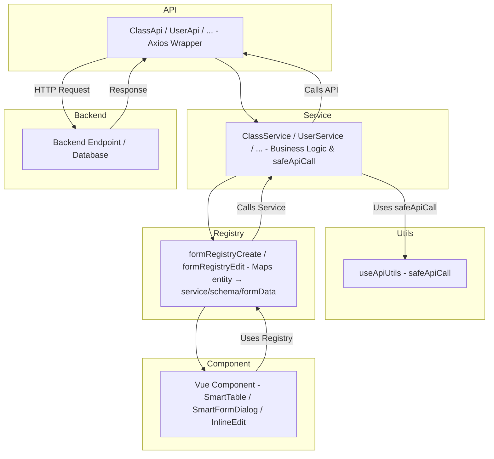

#  Admin Frontend Architecture

## 

This Admin frontend module uses a modular, scalable, and maintainable architecture. It follows a **Registry → Service → API** pattern, combined with dynamic forms and inline editing, making it easy to add new entities with minimal changes.

### Key Goals:
- Keep components decoupled from API logic.
- Centralize business logic in services.
- Enable dynamic form rendering for create/edit operations.
- Support inline editing with previous value revert and auto-save.
- Maintain pagination and filtered listing capabilities.

---

## Folder Structure

```
src/
├─ api/                  # Low-level HTTP requests (Axios)
│  ├─ admin/
│  │  ├─ class/          # API, DTO, service
│  │  ├─ staff/
│  │  ├─ student/
│  │  ├─ subject/
│  │  ├─ user/
│  │  └─ index.ts        # Admin service singleton & registry
├─ forms/                # Form schemas and data initializers
│  ├─ admin/
│  │  ├─ class/
│  │  ├─ staff/
│  │  ├─ student/
│  │  ├─ subject/
│  │  └─ user/
│  └─ register.ts         # Form registry mapping (create/edit)
├─ schemas/              # Dynamic form composables & type definitions
│  └─ registry/admin/
├─ services/             # High-level business logic & safe API wrapping
│  └─ formServices/
├─ components/           # Vue components (SmartTable, dialogs, buttons)
├─ composables/          # Reusable hooks (pagination, inline edit, dialogs)
├─ utils/                # Constants, helpers, enums
```

---

## � Data Flow

### 1. API Layer
- Handles HTTP requests via Axios.
- Each entity (User, Staff, Student, Class, Subject) has its own API and DTO files.
- Example: `StudentApi → getStudentPage, createStudent`.

### 2. Service Layer
- Wraps APIs with safe handling, logging, and business logic.
- Example: `StudentService` wraps `StudentApi` methods and returns clean data.

### 3. Registry Layer
- Maps entity type → `{ service, schema, formData }`.
- Separates create and edit workflows:

```typescript
formRegistryCreate['STUDENT'] = {
  service: () => studentForm.useServiceFormStudentInfo(),
  schema: studentForm.studentInfoFormSchema,
  formData: () => ({ ...studentForm.getStudentInfoFormData() }),
};
```

### 4.  Component Layer
- Components never call API directly.
- Example usage for dynamic form:

```typescript
const registryItem = formRegistryCreate['STUDENT'];
const formData = registryItem.formData();
const service = registryItem.service;
service.create(formData);
```

---

## Dynamic Forms & Inline Editing

- Uses `useDynamicCreateFormReactive` and `useDynamicEditFormReactive` for form dialogs.
- Inline editing is implemented with `useInlineEdit`, supporting:
  - Auto-save
  - Revert to previous value
  - Optimistic updates
- Pagination handled by `usePaginatedFetch` composable.

---

## Adding a New Module

1. **API**: Add Axios calls + DTO in `src/api/admin/<entity>/`.
2. **Service**: Wrap API calls in `src/api/admin/<entity>/service.ts`.
3. **Form Assets**: Add Yup/Zod schema + form data initializer in `src/forms/admin/<entity>/`.
4. **Registry**: Register entity in `formRegistryCreate` and `formRegistryEdit`.

---

## ✅ Benefits

| Principle | Benefit |
|-----------|---------|
| **Consistency** | Standardized API → Service → Registry → Component flow. |
| **Decoupling** | Components rely only on Registry, not services or APIs. |
| **Dynamic Forms** | Create/edit forms are fully reusable and reactive. |
| **Inline Editing** | Allows quick edits with undo & auto-save features. |
| **Pagination** | Fetching large datasets is efficient and reactive. |
| **Scalability** | Adding new entities requires minimal code changes. |

---

## Component Flow (Mermaid Diagram)



