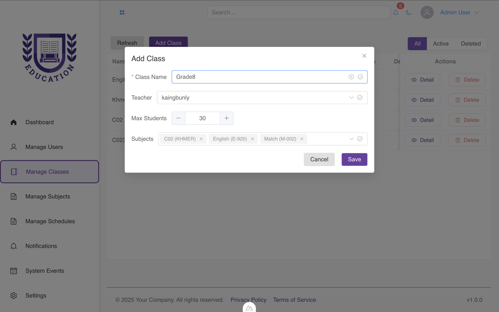

# School Management System

Full-stack school management system with **Nuxt 3**, **Flask**, and **MongoDB**.  
Features role-based access (Admin/Academic/Teacher/Student), dynamic forms, and inline editing.

---

## 🛠 Tech Stack

- **Frontend:** Nuxt 3, Vue 3, TypeScript, Tailwind CSS, Element Plus  
- **Backend:** Flask, PyMongo, Flask-CORS  
- **Database:** MongoDB  

---

## 🚀 Features

- Role-based modules (Admin, Teacher, Student)
- Dynamic form system with type-safe validation
- Inline table editing
- File uploads & notifications (Telegram bot support)
- Attendance tracking & grade management

---

## 📸 Screenshots

### Dashboard


### Dynamic Form



## ⚙️ Quick Start

**Prerequisites:** Docker, Docker Compose
```bash
# Clone and start
git clone 
cd 
docker-compose up --build
```

- **Frontend:** http://localhost:3000
- **Backend:** http://localhost:5001

Copy `.env.example` → `.env` in both `Frontend/` and `Backend/` folders.

---

## 📂 Structure
```
Backend/   # Flask API
Frontend/  # Nuxt 3 SPA
```

---

## ✅ Key Features

✓ Type-safe dynamic forms  
✓ Inline editing without page refresh  
✓ MongoDB for all data persistence  
✓ Docker containerized deployment